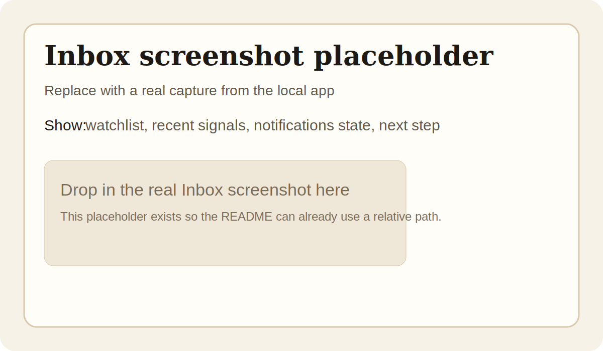
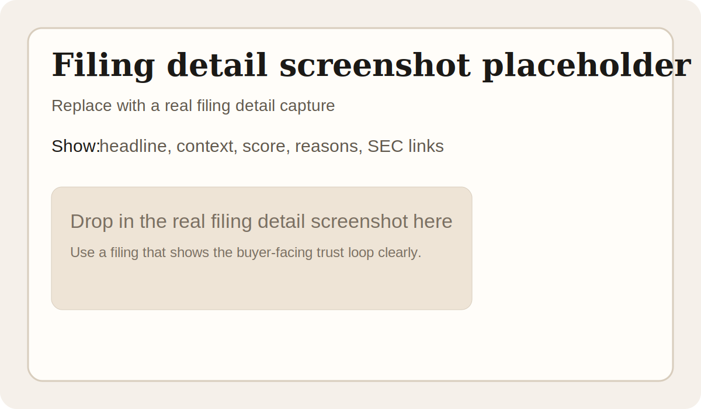
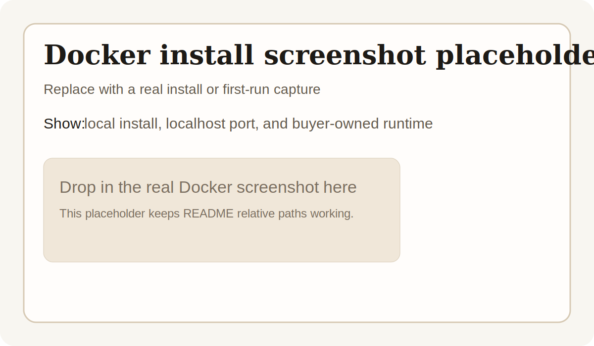

# SEC Alert Self-Hosted

Self-hosted SEC signal inbox for a focused watchlist.

This repository is being prepared for a first paid, one-time-purchase self-hosted release. The product is intentionally narrow: it helps one operator monitor a focused list of names, understand why a filing was flagged, and optionally route signals to Slack, webhooks, or SMTP email.

## Product promise

- Self-hosted and localhost-first.
- BYOK and environment-variable driven.
- Single-user and single-process in the supported release.
- SQLite-first and Docker-first.
- Near-real-time, not instant.
- SEC-friendly request behavior.
- Deterministic scoring first, with optional OpenAI rewrite for presentation text only.

## What it does

- Watchlist-based `8-K` and `Form 4` monitoring.
- Deterministic scoring with inspectable reasons.
- Filing detail pages with SEC source links.
- Optional Slack, webhook, and SMTP delivery.
- Repair and backfill for missed filings.
- Local Docker runtime for simple self-hosted deployment.

## What it is not

- Not a SaaS product.
- Not a multi-user team platform.
- Not a broad filing research terminal.
- Not an insider-only speed terminal.
- Not investment, tax, or legal advice.

## Screenshots

The repository currently includes clearly labeled placeholders. Replace them with real local captures before publishing the first paid release artifact.

See [docs/SCREENSHOT_CAPTURE.md](docs/SCREENSHOT_CAPTURE.md) for the capture checklist.



Inbox: current signals, watchlist state, and next-step actions.



Filing detail: what happened, why it was flagged, and how to verify it against the SEC.



Docker install: the supported buyer path for the first paid release.

## Fast buyer path

If you want the shortest path from zero to first useful signal:

1. Copy `.env.example` to `.env`.
2. Fill in `SEC_USER_AGENT`.
3. Run `make doctor`.
4. Start with Docker using `docker compose up --build`.
5. Open `http://127.0.0.1:8000`.
6. Add one ticker to the watchlist.
7. Run a manual 8-K or Form 4 check.
8. Open the first filing detail page.

Start with:

- [Buyer Quickstart](docs/BUYER_QUICKSTART.md)
- [Docker Install](docs/INSTALL_DOCKER.md)
- [Upgrade Guide](docs/UPGRADE.md)
- [Backup and Restore](docs/BACKUP_RESTORE.md)
- [Troubleshooting](docs/TROUBLESHOOTING.md)

## Release and support docs

- [Paid Release Gap Analysis](docs/PAID_RELEASE_GAP_ANALYSIS.md)
- [Commercial License](COMMERCIAL_LICENSE.md)
- [Support](SUPPORT.md)
- [Security](SECURITY.md)
- [Privacy](PRIVACY.md)
- [Disclaimer](DISCLAIMER.md)
- [Changelog](CHANGELOG.md)
- [Roadmap](ROADMAP.md)
- [Versioning](VERSIONING.md)
- [Release Checklist](RELEASE_CHECKLIST.md)
- [GitHub Metadata](docs/GITHUB_METADATA.md)

## Runtime notes

- `Inbox` shows what likely needs review now.
- `All Signals` is the archive/triage view.
- `Watchlist` controls what is monitored.
- `Notifications` controls where signals go.
- `Advanced` holds diagnostics, runtime posture, repair controls, and raw issue context.
- OpenAI, when enabled, only rewrites summary presentation text and never changes deterministic score, confidence, reasons, or alert eligibility.

## Notification notes

- Slack remains the reference delivery path.
- Webhook and SMTP follow the same delivery-attempt logging model.
- `SMTP_TO` supports a comma-separated recipient list.
- If no destination is configured, signals remain visible locally in the app.

## Release boundary

- This project is being packaged as a buyer-owned self-hosted runtime, not a managed hosted service.
- Secrets stay in `.env`.
- External API costs and credentials remain operator-controlled.
- Official support stays with the documented SQLite-first, Docker-friendly runtime.
- Current watchlist envelope remains conservative:
  - `25` validated
  - `50` hard cap
  - `100` unsupported

## Operator commands

```powershell
make doctor
make smoke
make backup
make restore BACKUP_ARCHIVE=backups\sec-alert-backup-YYYYMMDD-HHMMSS.zip
make release-bundle VERSION=v0.2.0
```

If `make` is not installed on your machine, run the underlying CLI directly:

```powershell
uv run --python 3.12 python -m app.cli.release doctor
uv run --python 3.12 python -m app.cli.release smoke
uv run --python 3.12 python -m app.cli.release backup
uv run --python 3.12 python -m app.cli.release restore --archive backups\sec-alert-backup-YYYYMMDD-HHMMSS.zip
uv run --python 3.12 python -m app.cli.release release-bundle --version v0.2.0
```

## Manual GitHub metadata

Repository description, topics, About text, and social preview still need to be applied manually in GitHub. The exact copy to paste is documented in [docs/GITHUB_METADATA.md](docs/GITHUB_METADATA.md).
